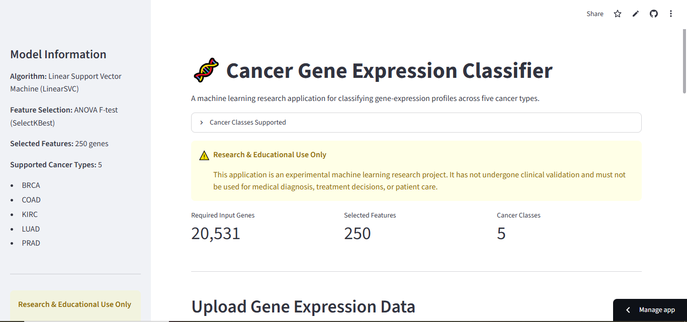
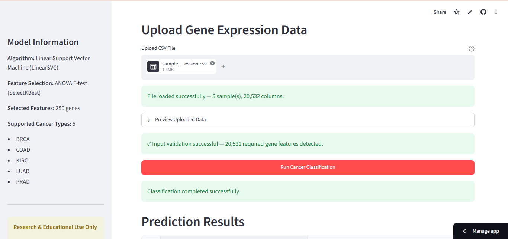
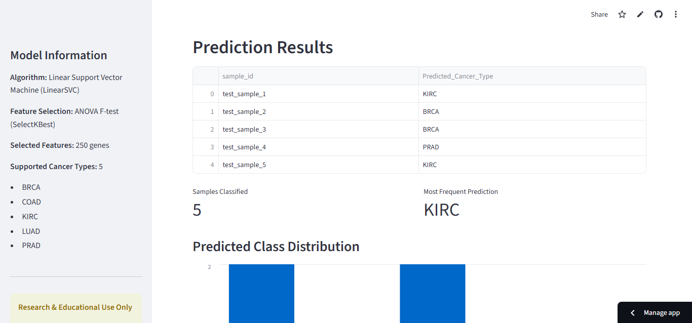
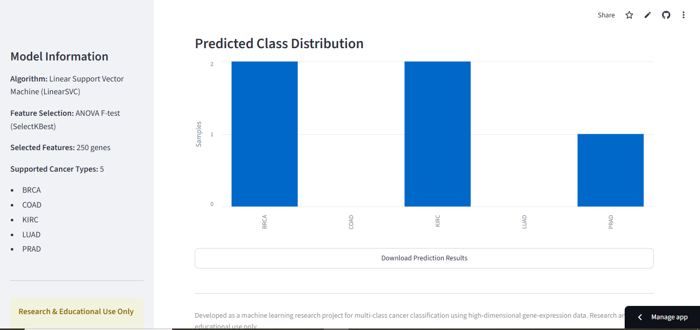
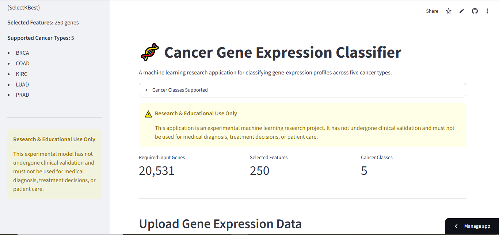

# Multi-Class Cancer Classification Using Gene Expression

A machine learning research project for classifying gene-expression profiles into five cancer types using a high-dimensional RNA-seq dataset.

**Live Demo:** https://cancer-gene-expression-classifier-kvchczqdnfvza6ysunutc9.streamlit.app/
**GitHub Repository:** https://github.com/waqarhussain709-dev/Cancer-Gene-Expression-Classifier

> **Research & Educational Use Only:** This project is experimental and has not undergone clinical validation. It must not be used for medical diagnosis, treatment decisions, or patient care.

---

## Project Overview

This project develops an end-to-end machine learning system for multi-class cancer classification using high-dimensional gene-expression data.

The system takes gene-expression profiles as input and predicts one of five cancer classes:

* **BRCA** — Breast Invasive Carcinoma
* **COAD** — Colon Adenocarcinoma
* **KIRC** — Kidney Renal Clear Cell Carcinoma
* **LUAD** — Lung Adenocarcinoma
* **PRAD** — Prostate Adenocarcinoma

The final predictive pipeline combines:

* Constant-feature filtering
* ANOVA F-test feature selection
* Feature standardization
* Linear Support Vector Machine classification

The trained model is integrated into a Streamlit web application that allows users to upload gene-expression data, validate the input, generate predictions, visualize the predicted class distribution, and download the results.

---

## Key Results

| Metric                            |  Result |
| --------------------------------- | ------: |
| Total Samples                     |     801 |
| Original Gene Features            |  20,531 |
| Features After Variance Filtering |  20,254 |
| Final Selected Features           |     250 |
| Cancer Classes                    |       5 |
| Test Accuracy                     | 100.00% |
| 5-Fold CV Mean Accuracy           | 99.875% |
| 5-Fold CV Standard Deviation      |   0.25% |

The final model achieved **100% accuracy on the held-out internal test set** and a **99.875% mean accuracy across 5-fold stratified cross-validation**.

These results represent internal evaluation performance and should not be interpreted as evidence of clinical effectiveness.

---

## Dataset

The project uses a gene-expression cancer dataset containing 801 biological samples and 20,531 gene-expression features.

### Dataset Summary

| Property                 |  Value |
| ------------------------ | -----: |
| Total Samples            |    801 |
| Gene-Expression Features | 20,531 |
| Cancer Classes           |      5 |

### Class Distribution

| Cancer Type | Number of Samples |
| ----------- | ----------------: |
| BRCA        |               300 |
| KIRC        |               146 |
| LUAD        |               141 |
| PRAD        |               136 |
| COAD        |                78 |

---

## Machine Learning Pipeline

The final predictive pipeline is implemented using Scikit-learn:

```text
Gene Expression Data
        │
        ▼
VarianceThreshold
Remove Constant Features
        │
        ▼
SelectKBest
ANOVA F-Test
        │
        ▼
StandardScaler
        │
        ▼
LinearSVC
        │
        ▼
Cancer Classification
```

Keeping preprocessing operations inside the Scikit-learn pipeline helps ensure that preprocessing is learned from the training data during cross-validation and model fitting, reducing the risk of preprocessing-related data leakage.

---

## Feature Filtering and Selection

Gene-expression datasets are highly dimensional. In this project, the number of gene features was substantially larger than the number of biological samples.

To make the predictive problem more manageable, feature processing was performed in two stages.

### Stage 1 — Variance Filtering

`VarianceThreshold` was used to remove constant features that contained no variation across the training data.

| Stage                     | Number of Features |
| ------------------------- | -----------------: |
| Original Features         |             20,531 |
| Constant Features Removed |                277 |
| Remaining Features        |             20,254 |

### Stage 2 — ANOVA Feature Selection

`SelectKBest` with the ANOVA F-test was then used to select the 250 highest-scoring features for the final predictive model.

| Stage                    | Number of Features |
| ------------------------ | -----------------: |
| After Variance Filtering |             20,254 |
| Final Selected Features  |                250 |

This reduced the predictive feature space from **20,531 to 250 features**.

---

## Train-Test Split

The dataset was divided using a stratified train-test split.

| Dataset      | Samples |
| ------------ | ------: |
| Training Set |     640 |
| Testing Set  |     161 |
| Total        |     801 |

Stratification was used to preserve the relative distribution of the five cancer classes between the training and testing sets.

An exact duplicate check found:

**Train-Test Duplicate Samples: 0**

---

## Final Model

The final predictive model consists of:

| Component                  | Method            |
| -------------------------- | ----------------- |
| Constant Feature Filtering | VarianceThreshold |
| Feature Selection          | SelectKBest       |
| Selection Method           | ANOVA F-Test      |
| Selected Features          | 250               |
| Feature Scaling            | StandardScaler    |
| Classification Algorithm   | LinearSVC         |
| Random State               | 42                |

---

## Model Comparison

Multiple classification approaches were evaluated during development.

| Model               | Test Accuracy |
| ------------------- | ------------: |
| Logistic Regression |        99.38% |
| 250-Gene Linear SVM |       100.00% |

The 250-feature Linear SVM was selected as the final model because it achieved the strongest internal test performance while operating on a substantially reduced feature set.

---

## Model Evaluation

### Held-Out Test Set

The final pipeline was evaluated on 161 samples that were not used for model fitting.

| Metric                |  Result |
| --------------------- | ------: |
| Test Samples          |     161 |
| Correct Predictions   |     161 |
| Incorrect Predictions |       0 |
| Test Accuracy         | 100.00% |

### Classification Report

| Cancer Type | Precision | Recall | F1-Score | Support |
| ----------- | --------: | -----: | -------: | ------: |
| BRCA        |      1.00 |   1.00 |     1.00 |      60 |
| COAD        |      1.00 |   1.00 |     1.00 |      16 |
| KIRC        |      1.00 |   1.00 |     1.00 |      30 |
| LUAD        |      1.00 |   1.00 |     1.00 |      28 |
| PRAD        |      1.00 |   1.00 |     1.00 |      27 |

### Cross-Validation

The final pipeline was evaluated using 5-fold stratified cross-validation.

```text
[1.00000, 1.00000, 1.00000, 1.00000, 0.99375]
```

| Metric                |  Result |
| --------------------- | ------: |
| Mean CV Accuracy      | 99.875% |
| Standard Deviation    |   0.25% |
| Minimum Fold Accuracy | 99.375% |
| Maximum Fold Accuracy | 100.00% |

The consistently high internal validation scores indicate strong performance across the evaluated data partitions. However, external validation on an independent dataset is still required to determine how well the model generalizes beyond this dataset.

---

## Selected Gene Analysis

The final model uses 250 selected gene-expression features.

The complete list is available in:

```text
metadata/Final_250_Selected_Genes.csv
```

Examples of influential features based on the LinearSVC coefficient analysis include:

### BRCA

* `gene_9652`
* `gene_6836`
* `gene_6876`
* `gene_18746`

### COAD

* `gene_5830`
* `gene_6487`
* `gene_3523`
* `gene_10098`

### KIRC

* `gene_12977`
* `gene_12068`
* `gene_18333`
* `gene_8794`

### LUAD

* `gene_15899`
* `gene_15633`
* `gene_15894`
* `gene_15591`

### PRAD

* `gene_13976`
* `gene_12847`
* `gene_753`
* `gene_16358`

> **Important:** These identifiers correspond to feature columns in the dataset and should not be interpreted as validated cancer biomarkers. Biological interpretation would require mapping the dataset features to official gene identifiers and performing independent biological validation.

---

## PCA Exploratory Analysis

Principal Component Analysis was used for exploratory visualization of the selected gene-expression features.

The first two principal components explained:

| Component | Explained Variance |
| --------- | -----------------: |
| PC1       |             39.84% |
| PC2       |             16.48% |
| Total     |             56.32% |

The PCA visualization was used to explore the structure of the selected feature space and the degree of separation between cancer classes.

PCA was **not used as the predictive transformation in the final classification pipeline**.

---

## Reproducibility

The final trained pipeline was serialized using Joblib:

```text
models/Final_250_Gene_Linear_SVM.pkl
```

The saved model was reloaded successfully and reproduced the same predictions as the original model.

```text
Reloaded Predictions Identical: True
Reloaded Model Test Accuracy: 100%
```

---

## Input Validation

The prediction backend validates uploaded data before sending it to the model.

Validation checks include:

* Input must be a Pandas DataFrame
* Dataset must not be empty
* Duplicate columns are detected
* Required gene columns are checked
* Missing gene features are detected
* Numeric feature values are validated
* Missing values are detected
* Gene columns are automatically arranged in the required order

The input CSV may optionally contain a:

```text
sample_id
```

column.

---

## Streamlit Application

The project includes a deployed Streamlit application.

### Application Features

Users can:

* Upload gene-expression data in CSV format
* Validate the input structure
* Detect missing or invalid gene features
* Run multi-class cancer classification
* View prediction results
* View predicted class distribution
* Download prediction results as CSV

### Live Application

**Cancer Gene Expression Classifier**

https://cancer-gene-expression-classifier-kvchczqdnfvza6ysunutc9.streamlit.app/

### Application Screenshots

The following screenshots demonstrate the deployed application's workflow, from the model interface and data upload through validation and prediction results.

#### 1. Application Interface



#### 2. Data Upload



#### 3. Input Validation



#### 4. Prediction Workflow



#### 5. Prediction Results



---

## Project Structure

```text
Cancer-Gene-Expression-Classifier/
│
├── app/
│   ├── app.py
│   └── predictor.py
│
├── models/
│   └── Final_250_Gene_Linear_SVM.pkl
│
├── data/
│   └── sample_input_gene_expression.csv
│
├── metadata/
│   ├── Final_250_Selected_Genes.csv
│   ├── model_metadata.json
│   └── required_gene_columns.csv
│
├── screenshots/
│   ├── streamlit1.PNG
│   ├── streamlit2.PNG
│   ├── streamlit3.PNG
│   ├── streamlit4.PNG
│   └── streamlit5.PNG
│
├── requirements.txt
├── .gitignore
└── README.md
```

---

## Installation

### 1. Clone the Repository

```bash
git clone https://github.com/waqarhussain709-dev/Cancer-Gene-Expression-Classifier.git
```

### 2. Navigate to the Project

```bash
cd Cancer-Gene-Expression-Classifier
```

### 3. Install Dependencies

```bash
pip install -r requirements.txt
```

### 4. Run the Streamlit Application

```bash
streamlit run app/app.py
```

The application will open locally in your browser.

---

## Technologies Used

* **Python**
* **Pandas**
* **NumPy**
* **Scikit-learn**
* **Joblib**
* **Streamlit**
* **Git & GitHub**
* **Google Colab**

---

## Limitations

Despite the strong internal evaluation results, this project has important limitations:

* The dataset contains only 801 samples.
* Evaluation was performed using an internal train-test split and cross-validation.
* No independent external validation dataset was used.
* The dataset feature identifiers have not been mapped to official biological gene symbols.
* The model has not undergone clinical validation.
* High internal accuracy does not guarantee performance on unseen external datasets.
* Gene-level biological interpretation requires additional domain-specific analysis.

Therefore, this project should be considered a **machine learning research and educational project**, not a clinical diagnostic system.

---

## Future Improvements

Potential future improvements include:

* External validation using independent cancer datasets
* Mapping feature identifiers to official gene symbols
* Biological pathway analysis
* More extensive model interpretability
* SHAP-based explanations
* Hyperparameter optimization
* Comparison with additional machine learning algorithms
* Deep learning model comparison
* Automated unit and integration testing
* Docker containerization
* CI/CD integration
* Cloud deployment improvements
* Model monitoring and versioning

---

## Disclaimer

This project is intended strictly for research and educational purposes.

It is **not a clinically validated diagnostic system** and must not be used for medical diagnosis, treatment planning, or patient care.

---

## Author

**Waqar Hussain**

BS Biotechnology | B.Ed. (Leadership & Management)

Machine Learning | AI Engineering | Data Science
